# trickle-structured

**Stream a typed, schema-validated object out of an LLM in one call. It wires an SSE response to incremental JSON parsing and schema coercion — yielding deep-partial snapshots as tokens arrive and a final validated value when the stream ends. Framework-agnostic; OpenAI and Anthropic envelopes built in.**

<p>
  <a href="https://www.npmjs.com/package/trickle-structured"></a>
  <a href="https://github.com/H1manshu01/trickle-structured/actions/workflows/ci.yml"></a>
  <a href="https://bundlephobia.com/package/trickle-structured"></a>
  
  <a href="./LICENSE"></a>
</p>



"Structured output" is where most LLM features actually land: you don't want prose, you want a typed object — a form filled in, a plan, a classification, a tool call's arguments. And you want it to **stream**, so the UI fills in as the model types rather than blocking on the last token. Doing that by hand means stitching three awkward pieces together: read the provider's SSE stream and pull the text deltas out of its envelope; parse a growing, *incomplete* JSON string into a usable partial on every chunk; and, when the stream ends, validate and repair the result against your schema. Each piece is a small library in this line. `trickle-structured` is the one call that composes them:

```
sse-wire (transport)  →  trickle-json (incremental parse)  →  coerce-json (validate + repair)
```

```ts
import { structured } from "trickle-structured";
import { z } from "zod";

const User = z.object({ id: z.number(), name: z.string(), active: z.boolean() });

const stream = structured(
  { url: "https://api.openai.com/v1/chat/completions",
    method: "POST",
    headers: { authorization: `Bearer ${key}`, "content-type": "application/json" },
    body: JSON.stringify({ model: "gpt-4o", stream: true, response_format: { type: "json_object" }, messages }) },
  User,
);

for await (const partial of stream) {
  render(partial);            // { }, { id: 42 }, { id: 42, name: "Ad" }, … typed as DeepPartial<User>
}

const user = await stream.value;  // User — validated, and repaired if the model slipped
```

One stream, two surfaces: **iterate** it for live partials, **await `.value`** for the final typed result. The underlying request runs exactly once no matter which (or both) you use.

## Why another one?

Streaming structured output is the end-goal of a whole stack of small problems, and the libraries that solve the *pieces* leave you to assemble the last mile. A provider SDK streams you text deltas but hands back no partial object and no schema guarantee. A partial-JSON parser gives you a growing value but knows nothing about SSE framing or your schema. A validator checks a finished value but can't help mid-stream, and rejects outright when the model emits a trailing comma or wraps the JSON in a ``` ```json ``` fence. `trickle-structured` is the glue, done once: typed partials on every chunk, a validated final value, provider envelopes decoded for you, and the repair step that turns almost-valid model output into a value that satisfies your schema.

| | trickle-structured | provider SDK streaming | partial-JSON parser alone | validate-at-end only |
|---|:---:|:---:|:---:|:---:|
| Streams typed **partial** objects | Yes (`DeepPartial<T>`) | — (text deltas) | Yes (untyped) | — |
| Final value **validated** against a schema | Yes | — | — | Yes |
| **Repairs** almost-valid output (fences, trailing commas, `"7"`→`7`) | Yes (coerce-json) | — | — | Usually rejects |
| Decodes OpenAI / Anthropic SSE envelopes | Built in + auto-detect | n/a (its own) | — | — |
| Streamed **tool/function-call** arguments | Yes (`mode: "tool"`) | Raw deltas | — | — |
| One stream → both partials **and** a final value | Yes | — | — | — |
| Abort / `AbortSignal` | Yes | Varies | n/a | n/a |
| Framework-agnostic, zero-config | Yes | n/a | Yes | Yes |

Comparison claims are **as of early 2026** — re-check each project before quoting it. The sibling libraries below are not competitors; they are the layers this package composes, and each is useful on its own.

## Install

```sh
npm install trickle-structured
```

```sh
npm install zod   # peer dependency, only if you pass a Zod schema (JSON Schema also works)
```

`trickle-structured` is the capstone of the author's LLM dev-tools line. It **depends on** three of them:
[`sse-wire`](https://www.npmjs.com/package/sse-wire) (fetch-based SSE transport),
[`trickle-json`](https://www.npmjs.com/package/trickle-json) (incremental partial-JSON parse), and
[`coerce-json`](https://www.npmjs.com/package/coerce-json) (schema repair/coercion).
Siblings you might pair with it:
[`trickle-react`](https://www.npmjs.com/package/trickle-react) (React bindings for the same pipeline),
[`context-budgeter`](https://www.npmjs.com/package/context-budgeter) (fit a history to the context window),
[`expect-llm`](https://www.npmjs.com/package/expect-llm) (LLM output assertions), and
[`retry-wire`](https://www.npmjs.com/package/retry-wire) (provider-aware retry/throttle).

Ships ESM + CJS + `.d.ts`. The orchestration layer is ~1.2 kB min+brotli (its three dependencies are separate, deduped packages, not bundled in). Runs anywhere modern JavaScript does: **Node ≥ 18** and modern **browsers** (anywhere `fetch` + `ReadableStream` exist). `zod` is an optional peer — pass a Zod schema, a JSON Schema, or a raw coerce-json spec.

## Quick start

### OpenAI (chat completions, JSON mode)

```ts
import { structured } from "trickle-structured";
import { z } from "zod";

const Recipe = z.object({
  title: z.string(),
  minutes: z.number(),
  ingredients: z.array(z.string()),
});

const stream = structured(
  {
    url: "https://api.openai.com/v1/chat/completions",
    method: "POST",
    headers: { authorization: `Bearer ${process.env.OPENAI_API_KEY}`, "content-type": "application/json" },
    body: JSON.stringify({
      model: "gpt-4o",
      stream: true,
      response_format: { type: "json_object" },
      messages: [{ role: "user", content: "A quick pasta recipe as JSON." }],
    }),
  },
  Recipe,
  { provider: "openai" }, // optional — auto-detected from the first event otherwise
);

for await (const partial of stream) {
  console.log(partial.title, partial.ingredients?.length ?? 0);
}

const recipe = await stream.value; // fully typed Recipe
```

### Anthropic (messages API)

```ts
const stream = structured(
  {
    url: "https://api.anthropic.com/v1/messages",
    method: "POST",
    headers: {
      "x-api-key": process.env.ANTHROPIC_API_KEY!,
      "anthropic-version": "2023-06-01",
      "content-type": "application/json",
    },
    body: JSON.stringify({
      model: "claude-3-5-sonnet-latest",
      max_tokens: 1024,
      stream: true,
      messages: [{ role: "user", content: "Return a recipe as a JSON object." }],
    }),
  },
  Recipe,
  { provider: "anthropic" },
);
```

## How it works

```
                 structured(request, schema, options)
                              │
     sse-wire ────────────────┼───────────────────────────────┐
     opens the POST, yields   │ for each event:                │
     parsed SSE events        │   extract(event) → text delta  │  ← provider envelope
                              │   accumulate text              │
     trickle-json ────────────┤   parser.writeChunk(delta)     │
     incremental parser       │   parser.snapshot() ──────────▶│  yield DeepPartial<T>
                              │                                │
     (stream ends cleanly)    │                                │
     coerce-json ─────────────┤   coerce(text, schema) ───────▶│  resolve .value + .changes
     validate + repair        │                                │
                              ▼                                ▼
                        AsyncIterable<DeepPartial<T>>     .value: Promise<T>
```

Feeding the parser character-by-character is **O(n)** total regardless of how the deltas are chunked, so a long object does not degrade to O(n²) re-parsing. The final `.value` is produced from the full accumulated text, so it benefits from coerce-json's fence-stripping and structural repair even when the raw stream was messy.

## API

### `structured(request, schema, options?) → StructuredStream<T>`

Opens the stream and returns immediately. Nothing is fetched until you touch a surface (iterate, or read `.value` / `.changes`) — and then exactly once.

- **`request`** — `{ url }` plus the usual fetch init (`method`, `headers`, `body`, …). This is handed to [`sse-wire`](https://www.npmjs.com/package/sse-wire); pass a custom `fetch` here for testing or non-standard runtimes. The abort signal goes in `options.signal`, not here.
- **`schema`** — a Zod schema, a JSON Schema, or a raw coerce-json spec. `T` is inferred from a Zod schema.
- **`options`** — see [below](#structuredoptions).

### `StructuredStream<T>`

```ts
interface StructuredStream<T> extends AsyncIterable<DeepPartial<T>> {
  readonly value: Promise<T>;        // resolves at clean end; rejects with CoercionError if it never fits
  readonly changes: Promise<Change[]>; // every repair coerce-json applied to produce `value`
  abort(reason?: unknown): void;     // stop the stream; iteration ends, pending promises reject
}
```

- **Iterating** yields one `DeepPartial<T>` snapshot per decoded chunk — every field optional at every depth, because the object is still being built. Snapshots share structure; `structuredClone` one if you need to keep it.
- **`.value`** resolves once the stream ends, with the validated, coerced result. If the output cannot satisfy the schema even after repair, it rejects with a [`CoercionError`](#coercionerror).
- **`.changes`** resolves with the list of repairs coerce-json made (a clean stream reports only the initial text→JSON parse). It resolves even when `.value` rejects, so you can inspect what was attempted.

Touching only one surface is fine — awaiting `.value` without iterating still drives the stream to completion, and iterating without awaiting `.value` never leaves an unhandled rejection.

### `StructuredOptions`

| Option | Type | Default | Meaning |
|---|---|---|---|
| `provider` | `"openai" \| "anthropic"` | auto-detect | Which response envelope to decode. |
| `extract` | `(event: SSEEvent) => string \| null` | — | Custom envelope decoder; takes precedence over `provider`. |
| `mode` | `"object" \| "tool"` | `"object"` | Decode message content, or a streamed tool/function call's JSON arguments. |
| `tool` | `string` | first call | In `"tool"` mode, which tool/function name to follow. |
| `coerce` | `CoerceOptions` | — | Passed through to coerce-json for the final `.value`. |
| `signal` | `AbortSignal` | — | Abort the stream externally (same effect as `.abort()`). |
| `onPartial` | `(partial: DeepPartial<T>) => void` | — | Called with every snapshot as it is produced. |

### `CoercionError`

Thrown from `.value` when the streamed output never satisfies the schema. Carries `.value` (the best-effort coerced value that still failed) and `.changes` (every repair attempted).

## Providers and extraction

With no `provider` set, the first decodable event is sniffed: an envelope with `choices` is treated as **OpenAI** (`choices[0].delta.content`), one with a `content_block` / `delta.type` is treated as **Anthropic** (`content_block_delta`), and anything else is treated as **raw** — `event.data` *is* the JSON text. Setting `provider` explicitly skips the sniff.

For anything exotic (a gateway, a custom proxy, a non-standard schema), supply your own `extract`:

```ts
const stream = structured(request, Schema, {
  extract: (event) => {
    const o = JSON.parse(event.data);
    return o.output?.text ?? null; // return the next text fragment, or null to skip this event
  },
});
```

The named decoders are exported too (`openaiContent`, `anthropicContent`, `openaiToolArgs`, `anthropicToolArgs`) if you want to compose your own.

## Tool-call mode

Models increasingly return structured data as a **tool/function call**, where the object lands in the call's `arguments` (OpenAI) or `input` (Anthropic) rather than in message content. Set `mode: "tool"` and the same pipeline streams those argument fragments instead:

```ts
const WeatherArgs = z.object({ city: z.string(), units: z.enum(["c", "f"]) });

const stream = structured(request, WeatherArgs, {
  provider: "openai",
  mode: "tool",
  tool: "get_weather", // follow this call when the response has several; omit to follow the first
});

const args = await stream.value; // { city: "Paris", units: "c" }
```

## Aborting

```ts
const stream = structured(request, Schema, { signal: ac.signal });
// …later:
stream.abort();          // or ac.abort()
```

Either path cancels the underlying fetch, ends iteration, and rejects the pending `.value` / `.changes`.

## Using it with React

`trickle-structured` is deliberately framework-agnostic — it's a plain async iterable plus a promise. For React, [`trickle-react`](https://www.npmjs.com/package/trickle-react) wraps the same pipeline in a `useStructuredStream` hook with partial state, status, and abort wired to the component lifecycle.

## Guardrails

- **One request per stream.** The fetch fires once, lazily, and is shared across both surfaces.
- **Partials are best-effort, the value is validated.** Never trust a `DeepPartial` as complete — render it, but gate logic on `.value`.
- **The final value is coerced from the full text**, so fences and trailing junk the model emits are repaired; inspect `.changes` to see what was changed.
- **No retries or rate-limiting here** — compose [`retry-wire`](https://www.npmjs.com/package/retry-wire) around the request if you need them.

## Types

Everything is exported: `StructuredRequest`, `StructuredOptions`, `StructuredStream`, `DeepPartial`, `Extractor`, `SchemaLike`, `Infer`, `CoercionError`, plus `Change` / `CoerceOptions` (from coerce-json) and `SSEEvent` / `SSEInit` (from sse-wire) for convenience.

## Development

```sh
npm install
npm test          # vitest, streams driven by an injected fake fetch (no network)
npm run build     # tsup → ESM + CJS + d.ts
npm run size      # size-limit (deps external)
npm run smoke     # run the built dist end-to-end under Node/Bun
```

## License

MIT © Himanshu Sharma
